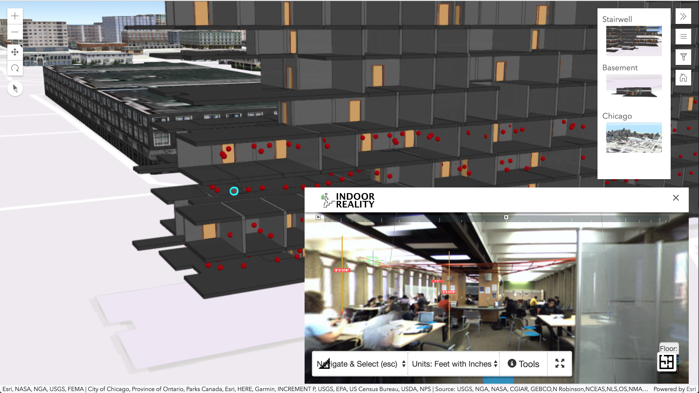

# Partner POCs

> Esri partners do awesome things, here are some joint POCs

## Contents

* **Indoor Reality** - 3D exploration of exterior *and* interior built environments. [code](/indoor-reality) & [live](https://mpayson.github.io/partner-pocs/indoor-reality/index.html)
* **Safegraph** - Live trade area visit & demographic data for LA retailers. [code](/safegraph) & [live](https://mpayson.github.io/partner-pocs/safegraph/index.html)
* **GroundVu** - Street exploration with 360º imagery and extracted, high resolution features. [code](/grounvu) & [live](http://sftp.ground.vu/phillips66/)

## Indoor Reality
